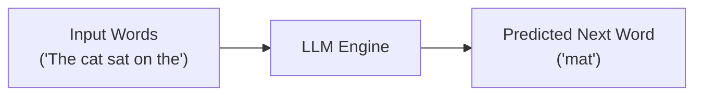
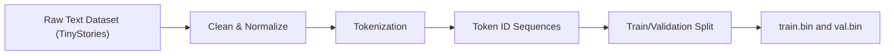
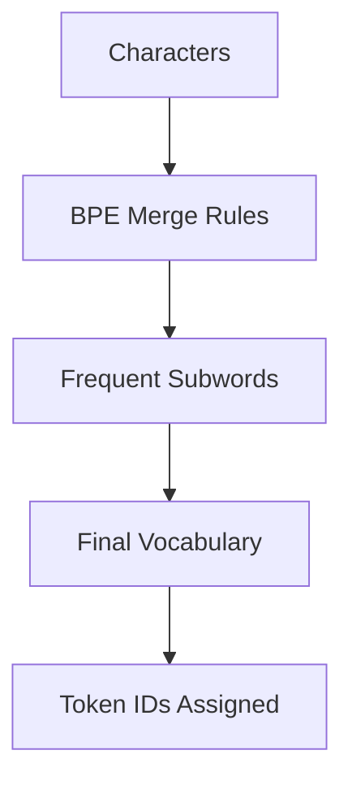

# 🛸 Understanding Language Models (Alien Analogy Explanation)

## 📍 Introduction
Imagine you are an **alien from outer space** who does **not understand any human language**.  
You cannot read or speak English, Hindi, French, anything.  
But you **do** understand **math** and **logical reasoning**.

Now someone gives you a sentence and asks:

> **“Predict the next word.”**

How would you do that if you don’t know the language?

This README explains how that leads to the concept of  
**Large Language Models (LLMs)** and **Small Language Models (SLMs)**.

---

# 1️⃣ Solution 1 — Use the Entire Internet (Inefficient)

You could:

- Collect **all books, blogs, articles, tweets, PDFs** on Earth  
- Search for similar sentences  
- Guess the next word based on raw frequency  

This requires effort roughly like:

x × x × x × … × x    (x = number of words on Earth)

This approach is **computationally explosive** and unrealistic.

---

# 2️⃣ Solution 2 — Build a Model to Predict the Next Word

Instead of memorizing everything, build a **mathematical model** that learns patterns  
and can **predict the next word from context**, even for sentences it has never seen before.

This type of model is called a:

# 🚀 **Large Language Model (LLM)**

---

# 🔧 LLM as a Next-Word Predicting Engine (Diagram)



An LLM takes a sequence of words and outputs the most probable next word.

---

# 🏗️ Why Are They Called “Large”?

Because of the **number of parameters** (learnable weights) they contain.

### 📌 Examples
| Model / Equation | Parameters |
|------------------|------------|
| Linear equation y = mx + c | 2 |
| Quadratic equation y = ax² + bx + c | 3 |
| GPT-3 | 175,000,000,000+ |

Parameters = knobs the model adjusts during training.

---

# 🎯 Is Next-Token Prediction Probabilistic or Deterministic?

It is **probabilistic**.

The model outputs a **probability distribution** over all possible next words.

Example:

| Word | Probability |
|-------|-------------|
| mat | 0.67 |
| dog | 0.12 |
| street | 0.08 |

The word with the **highest probability** is chosen.

---

# 📈 Why Do We Need So Many Parameters?

As researchers scaled model size, they found:

- Accuracy improves  
- Reasoning improves  
- Language understanding gets deeper  

This relationship is shown in the GPT-3 scaling laws.

---

# 📊 GPT-3 Scaling Law Graph (Actual Image)


---

# 🧬 Why Build Bigger and Bigger Models?

Large models show **emergent properties** —  
capabilities that smaller models do *not* have at all.

These include:

- Translation  
- Reasoning  
- Code generation  
- Multi-step logic  
- Summarization  
- Humor understanding  

We don't know the exact threshold at which these abilities appear.

So researchers keep building bigger models to discover new emergent skills.

---

# 📈 Emergent Abilities Graph (Actual Image)


---

# 🧠 What Else Do LLMs Learn?

Even though we **only** ask the model to predict the next word…

It automatically learns:

- Grammar (form)  
- Meaning (semantics)  
- Structure  
- Relationships between concepts  
- World knowledge patterns  

All as a **side effect** of predicting the next token.

---

# 🔍 What If We Don’t Want a Full General Language Model?

Sometimes you only want the model to learn **one domain**, such as:

- Medical texts  
- Legal contracts  
- Semiconductor manufacturing data  
- Finance documents  
- Customer support chat logs  
- Programming code  

A small dataset → fewer patterns → **fewer parameters needed**.

Thus we get:

# 🌱 **Small Language Models (SLMs)**

Focused  
Efficient  
Domain-special  
Cheaper to train  
Ideal for constrained hardware

---
# Building a Small Language Model (SLM)

## 1. Choosing a Dataset

TinyStories dataset is used as it captures grammar, syntax, and story
structure in simple language ideal for small models.



## 2. Data Preprocessing & Tokenization

### ❌ Word-based Tokenization

-   Huge vocabulary\
-   OOV (Out-of-Vocabulary) issues\
-   Misspelled or rare words cannot be encoded\
-   Slow & brittle

### ❌ Character-based Tokenization

-   Small vocabulary (\~26--100 tokens)\
-   Very long sequences → slower training\
-   Loses semantic meaning

### ✅ Subword Tokenization (BPE)

Modern LLMs use BPE because it: - Solves OOV\
- Preserves meaning\
- Efficient vocab size\
- Faster training\
- Works with misspellings



## 3. Text to Token IDs

After tokenizer training: - Each story becomes a sequence of integer
token IDs\
- All stories are concatenated into one long token stream

## 4. Train/Validation Split

``` mermaid
flowchart LR
    A[All Token IDs] --> B[Split 80/20]
    B --> C[Train Tokens 80%]
    B --> D[Validation Tokens 20%]
    C --> E[train.bin (memmap)]
    D --> F[val.bin (memmap)]
```
