# 🛸 Understanding Language Models (Alien Analogy Explanation)

## 📍 Introduction
Imagine you are an **alien from outer space** who does **not understand any human language**.  
You cannot read or speak English, Hindi, French, anything.  
But you **do** understand **math** and **logical reasoning**.

Now someone gives you a sentence and asks:

> **“Predict the next word.”**

How would you do that if you don’t know the language?

This README explains how that leads to the concept of  
**Large Language Models (LLMs)** and **Small Language Models (SLMs)**.

---

# 1️⃣ Solution 1 — Use the Entire Internet (Inefficient)

You could:

- Collect **all books, blogs, articles, tweets, PDFs** on Earth  
- Search for similar sentences  
- Guess the next word based on raw frequency  

This requires effort roughly like:

x × x × x × … × x    (x = number of words on Earth)

This approach is **computationally explosive** and unrealistic.

---

# 2️⃣ Solution 2 — Build a Model to Predict the Next Word

Instead of memorizing everything, build a **mathematical model** that learns patterns  
and can **predict the next word from context**, even for sentences it has never seen before.

This type of model is called a:

# 🚀 **Large Language Model (LLM)**

---

# 🔧 LLM as a Next-Word Predicting Engine (Diagram)

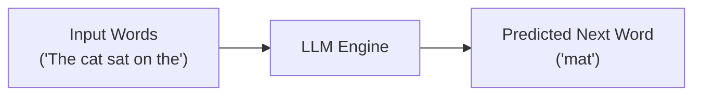

An LLM takes a sequence of words and outputs the most probable next word.

---

# 🏗️ Why Are They Called “Large”?

Because of the **number of parameters** (learnable weights) they contain.

### 📌 Examples
| Model / Equation | Parameters |
|------------------|------------|
| Linear equation y = mx + c | 2 |
| Quadratic equation y = ax² + bx + c | 3 |
| GPT-3 | 175,000,000,000+ |

Parameters = knobs the model adjusts during training.

---

# 🎯 Is Next-Token Prediction Probabilistic or Deterministic?

It is **probabilistic**.

The model outputs a **probability distribution** over all possible next words.

Example:

| Word | Probability |
|-------|-------------|
| mat | 0.67 |
| dog | 0.12 |
| street | 0.08 |

The word with the **highest probability** is chosen.

---

# 📈 Why Do We Need So Many Parameters?

As researchers scaled model size, they found:

- Accuracy improves  
- Reasoning improves  
- Language understanding gets deeper  

This relationship is shown in the GPT-3 scaling laws.

---

# 📊 GPT-3 Scaling Law Graph (Actual Image)


---

# 🧬 Why Build Bigger and Bigger Models?

Large models show **emergent properties** —  
capabilities that smaller models do *not* have at all.

These include:

- Translation  
- Reasoning  
- Code generation  
- Multi-step logic  
- Summarization  
- Humor understanding  

We don't know the exact threshold at which these abilities appear.

So researchers keep building bigger models to discover new emergent skills.

---

# 📈 Emergent Abilities Graph (Actual Image)


---

# 🧠 What Else Do LLMs Learn?

Even though we **only** ask the model to predict the next word…

It automatically learns:

- Grammar (form)  
- Meaning (semantics)  
- Structure  
- Relationships between concepts  
- World knowledge patterns  

All as a **side effect** of predicting the next token.

---

# 🔍 What If We Don’t Want a Full General Language Model?

Sometimes you only want the model to learn **one domain**, such as:

- Medical texts  
- Legal contracts  
- Semiconductor manufacturing data  
- Finance documents  
- Customer support chat logs  
- Programming code  

A small dataset → fewer patterns → **fewer parameters needed**.

Thus we get:

# 🌱 **Small Language Models (SLMs)**

Focused  
Efficient  
Domain-special  
Cheaper to train  
Ideal for constrained hardware

---
# Building a Small Language Model (SLM) - Complete Guide

## 1. Choosing a Dataset

TinyStories dataset is used as it captures grammar, syntax, and story structure in simple language ideal for small models.


## 2. Data Preprocessing & Tokenization

Tokenization is the process of converting text into numerical tokens that a model can process. It's like creating a dictionary where each entry gets a unique number.

### ❌ Word-based Tokenization

**How it works:** Each unique word becomes one token
- Example: "The cat runs" → `[452, 234, 789]`

**Problems:**
- Huge vocabulary (100,000+ tokens for English)
- Out-of-Vocabulary (OOV) issues - can't handle new/rare words
- Misspelled words cannot be encoded
- Related words treated as completely different: "run", "runs", "running" are 3 separate tokens
- Slow & brittle
- Wastes model capacity learning similar words separately

### ❌ Character-based Tokenization

**How it works:** Each character (letter) becomes one token
- Example: "cat" → `[c, a, t]` → `[3, 1, 20]`

**Problems:**
- Small vocabulary (~26-100 tokens) ✓
- Very long sequences → much slower training
- Model must learn to build words from scratch
- Loses semantic meaning - "c", "a", "t" individually mean nothing
- "understanding" = 13 tokens instead of 1-3

### ✅ Subword Tokenization (BPE - Byte Pair Encoding)

**How it works:** Words are split into meaningful subword units based on frequency

Modern LLMs use BPE because it provides the best balance:

**Advantages:**
- **Solves OOV problem:** Can encode any word by breaking into known pieces
- **Preserves meaning:** Common words stay whole, rare words split meaningfully
- **Efficient vocabulary:** Typically 5,000-50,000 tokens (optimal size)
- **Faster training:** Shorter sequences than character-level
- **Handles misspellings:** Unknown words decompose into recognizable parts
- **Language agnostic:** Works across different languages

**Example of BPE in action:**

```
Common word: "the" → ["the"] (stays whole)
Rare word: "understanding" → ["under", "stand", "ing"]
Misspelled: "runnnning" → ["run", "nn", "ning"]
New word: "unbelievablex" → ["un", "believ", "able", "x"]
```

### How BPE Training Works

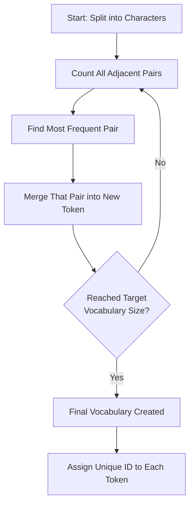

**Step-by-step example:**

1. **Initial text:** "low", "lower", "lowest", "flower"
2. **Split to characters:** `['l','o','w'], ['l','o','w','e','r'], ['l','o','w','e','s','t'], ['f','l','o','w','e','r']`
3. **Count pairs:** ('l','o')=4 times, ('o','w')=4 times, ('w','e')=3 times...
4. **Merge most frequent:** ('l','o') → token 'lo'
5. **Repeat:** 'lo' + 'w' → 'low', eventually creating meaningful subwords

**Result:** The model learns that "low", "er", "est", "flow" are meaningful units!

## 3. Text to Token IDs

After tokenizer training:

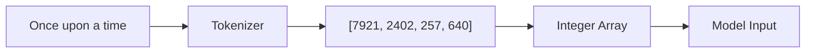

- Each story becomes a sequence of integer token IDs
- All stories are concatenated into one long token stream
- The model learns to predict the next token ID given previous ones

**Example:**
```
Text: "Once upon a time, there was a little girl."
Tokens: ["Once", "upon", "a", "time", ",", "there", "was", "a", "little", "girl", "."]
Token IDs: [7921, 2402, 257, 640, 11, 612, 373, 257, 1310, 2576, 13]
```

## 4. Train/Validation Split

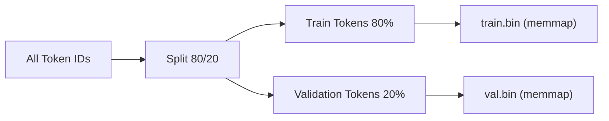

**Why split?**
- **Training set (80%):** Model learns patterns from this
- **Validation set (20%):** Tests if model generalizes to unseen data
- Prevents overfitting - ensures model truly understands language, not just memorizes

**Binary format (.bin):**
- Stores token IDs as raw integers (numpy arrays)
- Memory-mapped (memmap) for efficient loading
- Faster than loading text files during training
- Typical size: Millions to billions of tokens
- 

Here we are tokenizing and creating train.bin and validation.bin file:

```python
!pip install tiktoken
import tiktoken
import os
import numpy as np
from tqdm.auto import tqdm

enc=tiktoken.get_encoding("gpt2")

def process(example):
  ids=enc.encode_ordinary(example["text"])
  out={'ids':ids,'len':len(ids)}
  return out


if not os.path.exists("train.bin"):
  tokenized=ds.map(
      process,
      remove_columns=['text'],
      desc="tokenizing the splits",
      num_proc=8
  )

  for split, dset in tokenized.items():
    arr_len=np.sum(dset['len'], dtype=np.uint64)
    filename=f'{split}.bin'
    dtype=np.uint16
    arr=np.memmap(filename, dtype=dtype, mode='w+', shape=(arr_len,))
    total_batches=1024

    idx=0
    for batch_idx in tqdm(range(total_batches), desc=f'writing {filename}'):
      batch=dset.shard(num_shards=total_batches, index=batch_idx, contiguous=True).with_format('numpy')
      arr_batch=np.concatenate(batch['ids'])
      arr[idx:idx+len(arr_batch)]=arr_batch
      idx+=len(arr_batch)
    arr.flush()
```

# Creating Input-Output Pairs from Dataset

## Core Concepts: Context Window & Batch Size

Before creating training data, we need to understand two fundamental parameters:

### 1. Context Window (Sequence Length)
**Definition:** The number of tokens the model looks at simultaneously to predict the next token.

**Why it matters:**
- Determines how much "memory" the model has
- Larger context = model sees more history but requires more computation
- Smaller context = faster training but limited understanding

### 2. Batch Size
**Definition:** The number of training examples processed together in one forward pass.

**Why it matters:**
- Affects training speed and memory usage
- Larger batches = more stable gradients but more GPU memory needed
- Smaller batches = less memory but noisier training

---

## Example: Building Input-Output Pairs

### The Text
```
"Bali is a captivating Indonesian island known for its rich Hindu culture, 
reflected in elaborate dances and temples like the Mother Temple, Besakih..."
```

### Setting: Context Window = 4

Let's see how this works step by step:

#### Step 1: Tokenize the Text
```
Text:   "Bali is a captivating Indonesian..."
Tokens: [1, 11, 15, 24, 43, 52, 67, ...]
         ↑   ↑   ↑   ↑   ↑
       Bali is  a  capt Indo
```

#### Step 2: Create Sliding Window
```
Input:  [1,  11, 15, 24]  →  "Bali is a captivating"
Output: [11, 15, 24, 43]  →  "is a captivating Indonesian"
```

**At first glance:** It looks like ONE prediction task.

**Reality:** It contains **4 simultaneous prediction tasks!**

---

## The Hidden Magic: Multiple Predictions in One

### Breaking Down the 4 Prediction Tasks

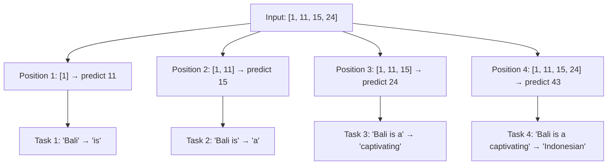

### The 4 Prediction Tasks Explained

| Task | Input Tokens | Input Text | Target | Target Text |
|------|-------------|------------|--------|-------------|
| 1 | `[1]` | "Bali" | `11` | "is" |
| 2 | `[1, 11]` | "Bali is" | `15` | "a" |
| 3 | `[1, 11, 15]` | "Bali is a" | `24` | "captivating" |
| 4 | `[1, 11, 15, 24]` | "Bali is a captivating" | `43` | "Indonesian" |

### Ground Truth vs Model Predictions

**Ground Truth (What we want):**
```
Position 1: "is"
Position 2: "a"
Position 3: "captivating"
Position 4: "Indonesian"
```

**Model Prediction (Before training):**
```
Position 1: "the"      ❌
Position 2: "capital"  ❌
Position 3: "of"       ❌
Position 4: "Indonesia" ❌
```

**Goal:** Adjust the model's **parameters** (the internal knobs/weights) so predictions match ground truth.

---

## Batching: Processing Multiple Examples Together

### Batch Structure

```
Context Window = 4 tokens
Batch Size = 4 examples

INPUT (X):
┌─────────────────────┐
│ x1: [1,  11, 15, 24]│  ← Example 1
│ x2: [11, 13, 14, 17]│  ← Example 2
│ x3: [6,  8,  9,  18]│  ← Example 3
│ x4: [1,  7,  6,  7] │  ← Example 4
└─────────────────────┘
    ↓   ↓   ↓   ↓
   col col col col
    1   2   3   4

OUTPUT (Y):
┌─────────────────────┐
│ y1: [11, 15, 24, 43]│  ← Targets for Example 1
│ y2: [13, 14, 17, 4] │  ← Targets for Example 2
│ y3: [8,  9,  18, 20]│  ← Targets for Example 3
│ y4: [7,  6,  7,  9] │  ← Targets for Example 4
└─────────────────────┘
```

**Matrix Dimensions:**
- Number of **rows** = Batch Size (4)
- Number of **columns** = Context Window (4)
- **Total predictions per batch** = 4 rows × 4 positions = **16 predictions**

---

## Why LLMs are Called "Autoregressive"

### Autoregressive = Output Becomes Next Input

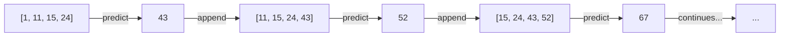

**Step-by-step generation:**
```
Step 1: [1, 11, 15, 24] → predict 43 → "Indonesian"
Step 2: [11, 15, 24, 43] → predict 52 → "island"
Step 3: [15, 24, 43, 52] → predict 67 → "known"
...and so on
```

**Key Insight:** Each prediction feeds back as input for the next prediction. The model generates text one token at a time, using its own previous outputs.

---

## Why LLMs are Called "Self-Supervised"

### Self-Supervised = Data Labels Itself

**Traditional Supervised Learning:**
```
Humans label data:
Image → "cat" ✓
Email → "spam" ✓
Text → "positive sentiment" ✓
```

**Self-Supervised Learning (LLMs):**
```
Data creates its own labels:
Input:  "Bali is a"     → Label: "captivating" (next word)
Input:  "The cat sat"   → Label: "on" (next word)
Input:  "Python is a"   → Label: "programming" (next word)
```

**No human annotation needed!** The model learns by:
1. Taking any text
2. Creating input (first N tokens)
3. Using the next token as the label
4. Repeat for entire dataset

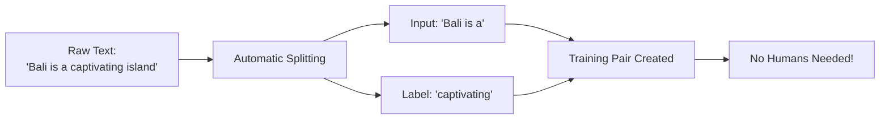

---

---

## Historical Context & Model Sizes

### Context Window Evolution

| Model | Year | Context Window | Parameters |
|-------|------|----------------|------------|
| GPT-1 | 2018 | 512 tokens | 117M |
| GPT-2 | 2019 | **1,024 tokens** | 1.5B |
| GPT-3 | 2020 | 2,048 tokens | 175B |
| GPT-4 | 2023 | 8,192-32,768 tokens | Unknown |
| Claude 3 | 2024 | 200,000 tokens | Unknown |

**GPT-2's 1,024 token context window** was revolutionary in 2019:
- Could "remember" ~750-800 words at once
- About 3-4 paragraphs of context
- Enabled coherent long-form generation

---

## Practical Implications

### Context Window Trade-offs

**Smaller Context (e.g., 128 tokens):**
- ✅ Faster training
- ✅ Less memory usage
- ✅ Good for simple tasks
- ❌ Limited "memory"
- ❌ Can't handle long conversations

**Larger Context (e.g., 4,096 tokens):**
- ✅ Better long-range understanding
- ✅ Can handle complex documents
- ✅ More coherent outputs
- ❌ Quadratic memory growth (O(n²))
- ❌ Much slower training

### Batch Size Trade-offs

**Smaller Batch (e.g., 4-16):**
- ✅ Fits in less GPU memory
- ✅ More frequent weight updates
- ❌ Noisy gradients
- ❌ Less stable training

**Larger Batch (e.g., 256-1024):**
- ✅ Smoother gradients
- ✅ Better GPU utilization
- ✅ More stable training
- ❌ Requires massive GPU memory
- ❌ Fewer weight updates per epoch

---

Here we are creating input output pairs:
```python
def get_batch(split):
  if split=='train':
    data=np.memmap('train.bin', dtype=np.uint16, mode='r')
  else:
    data=np.memmap('validation.bin', dtype=np.uint16, mode='r')

  ix=torch.randint(len(data)-block_size, (batch_size,))
  x=torch.stack([torch.from_numpy((data[i:i+block_size]).astype(np.int64)) for i in ix])
  y=torch.stack([torch.from_numpy((data[i+1:i+1+block_size]).astype(np.int64)) for i in ix])
  if device_type == 'cuda':
    x,y=x.pin_memory().to(device, non_blocking=True), y.pin_memory().to(device, non_blocking=True)
  else:
    x,y=x.to(device), y.to(device)

  return x,y
```

# Transformer Block Architecture: A Complete Guide

## Overview

This document explains the architecture of a Transformer block (specifically GPT-2 style) with detailed explanations and diagrams at each step.

---

## 1. Input Text Tokenization

**Process:** Every token/word is converted into token IDs.

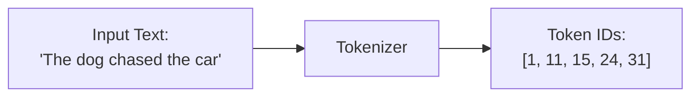

---

## 2. Token Embeddings

**What it does:** Words are represented as vectors of numbers.

**Parameters:**
- Dictionary size: 50,257 words (hyperparameter)
- Embedding dimension: 768
- Token embedding matrix size: **50,257 × 768**
- Total parameters: **~38 million**

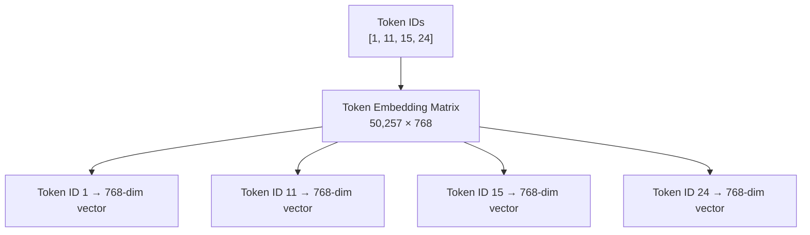

**Example:** For token ID `1`, we look up the 1st row in the token embedding matrix and get a 768-dimension vector. Similarly for `11`, `15`, `24`, etc.

---

## 3. Positional Embeddings

**Why needed:** The order/position of words is crucial for understanding context.

**Example:** 
- *"The dog chased the car. It could not catch it."*
- First "it" → dog
- Second "it" → car

**Parameters:**
- Context size: 1024 (for GPT-2) - hyperparameter
- Embedding dimension: 768
- Position embedding matrix size: **1,024 × 768**
- Total parameters: **~0.7 million**

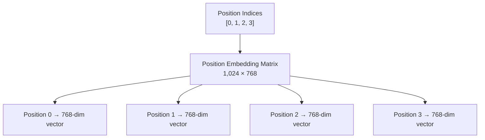

---

## 4. Input Embeddings (Addition)

**Process:** Add token embeddings + position embeddings element-wise.

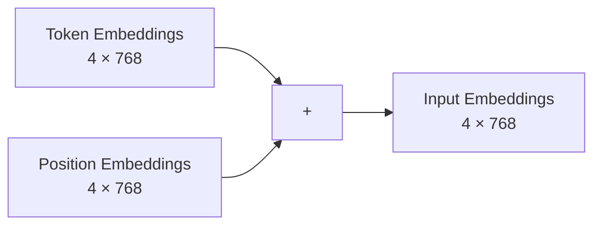

**Result:** We now have input embedding vectors for each word in the context window.

---

## 5. Initial Dropout

**Purpose:** Randomly set some values to 0 to improve generalization (prevents overfitting).

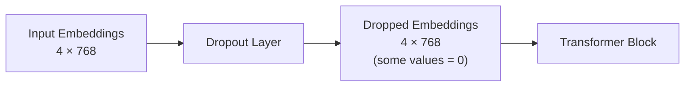

---

## 6. Transformer Block - Layer Norm 1

**Purpose:** Normalize input so that mean = 0, variance = 1. This makes training smoother.

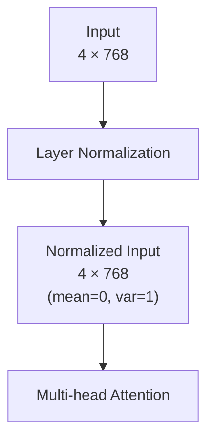

---

## 7. Multi-Head Attention

**Critical Step:** Until now, there's no interaction between tokens. This layer enables each word to understand its context in the sentence.

**Before:** Input embeddings (4 × 768)  
**After:** Context vectors (4 × 768) - same size, but now each word knows the context!

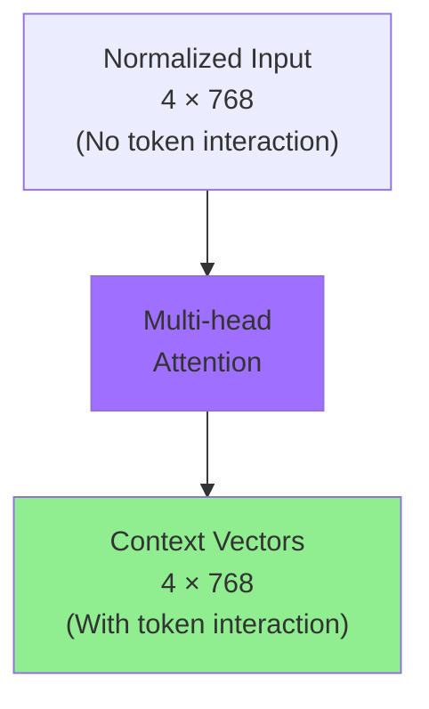

**Key Point:** After this block, we call them **context vectors** instead of input embeddings because each word now understands its context.

---

## 8. Dropout + Shortcut Connection 1

**Dropout:** Again, randomly set some values to 0 for generalization.

**Shortcut Connection:** Add the original input to help with smoother training (residual connection).

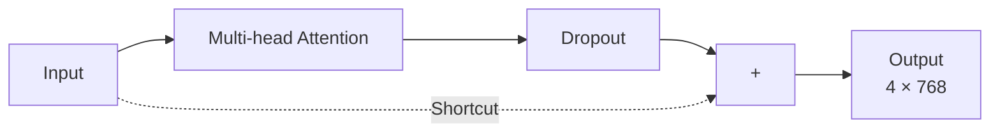

---

## 9. Layer Norm 2

**Purpose:** Normalize again before the feed-forward network.

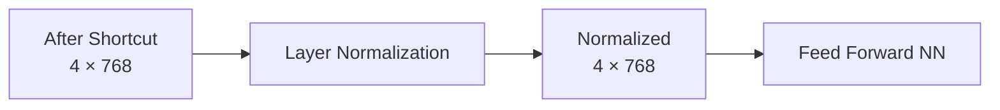

---

## 10. Feed Forward Neural Network

**Architecture:**
- Input layer: 768 dimensions
- Hidden layer: 4 × 768 = **3,072 dimensions** (expansion)
- Output layer: 768 dimensions (compression)

**Why expand?** The higher dimension provides a richer space to discover more meaningful context.

**Parameters per block:** 768 × (4 × 768) × 2 ≈ **4.7 million parameters**

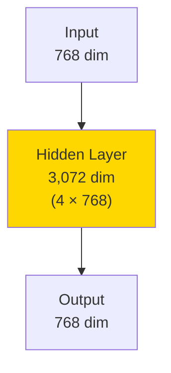

**For batch of 4 tokens:**

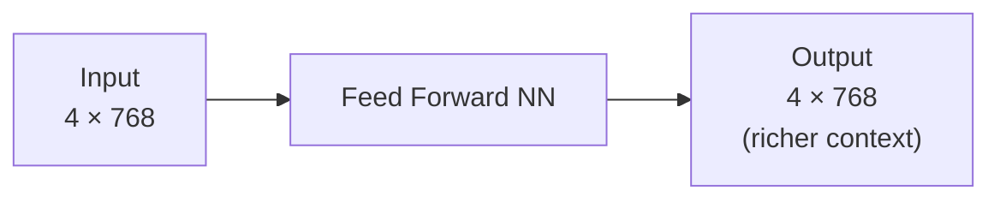

---

## 11. Dropout + Shortcut Connection 2

**Final step in the transformer block:**

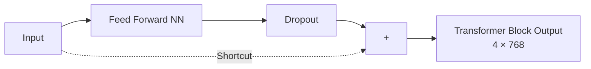

---

## 12. Multiple Transformer Blocks

**Important:** This is just **ONE** transformer block iteration. GPT-2 has **12 such blocks stacked together**.

```mermaid
graph TD
    A["Input Embeddings"] --> B["Transformer Block 1"]
    B --> C["Transformer Block 2"]
    C --> D["Transformer Block 3"]
    D --> E["..."]
    E --> F["Transformer Block 12"]
    F --> G["Output"]
    
    style B fill:#9f6fff
    style C fill:#9f6fff
    style F fill:#9f6fff
```

**Total parameters in Feed Forward networks:** 12 × (768 × 4 × 768 × 2) ≈ **~40 million parameters**

---

## 13. Output Layer

After all transformer blocks, the final output goes through:

```mermaid
graph LR
    A["Transformer Block 12 Output<br/>4 × 768"] --> B[Final Layer Norm]
    B --> C["Output Layer<br/>50,257 (vocab size)"]
    C --> D["Logits Matrix<br/>for next token prediction"]
```

---

## Complete Architecture Summary

```mermaid
graph TD
    A["Tokenized Text"] --> B["Token Embeddings<br/>~38M params"]
    A2["Positional Info"] --> C["Position Embeddings<br/>~0.7M params"]
    B --> D["+"]
    C --> D
    D --> E["Input Embeddings"]
    E --> F["Dropout"]
    F --> G["Transformer Block 1-12<br/>~40M params in FF layers"]
    G --> H["Final Layer Norm"]
    H --> I["Output Layer"]
    I --> J["Next Token Prediction"]
    
    style G fill:#9f6fff
```

---

## Key Hyperparameters

| Parameter | GPT-2 Value | Description |
|-----------|-------------|-------------|
| Vocabulary Size | 50,257 | Dictionary size (tokens) |
| Embedding Dimension | 768 | Vector size for each token |
| Context Size | 1,024 | Maximum sequence length |
| Number of Blocks | 12 | Stacked transformer blocks |
| FF Hidden Size | 3,072 | 4 × embedding dimension |

---

## Parameter Count Breakdown

1. **Token Embeddings:** 50,257 × 768 ≈ 38M
2. **Position Embeddings:** 1,024 × 768 ≈ 0.7M
3. **Feed Forward Networks (12 blocks):** 12 × 4.7M ≈ 40M
4. **Attention Layers:** Additional millions
5. **Total for GPT-2:** **~117 million parameters**

---

## Key Concepts Summary

- **Dropout:** Regularization technique to prevent overfitting
- **Layer Norm:** Stabilizes training by normalizing inputs
- **Shortcut Connections:** Enable gradient flow in deep networks
- **Multi-head Attention:** Allows tokens to interact and build context
- **Feed Forward Network:** Expands to richer representation space
- **Context Vectors:** Embeddings enriched with contextual information
