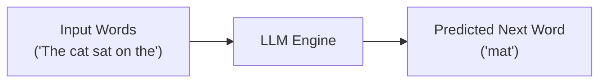
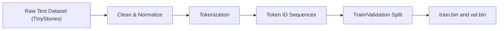
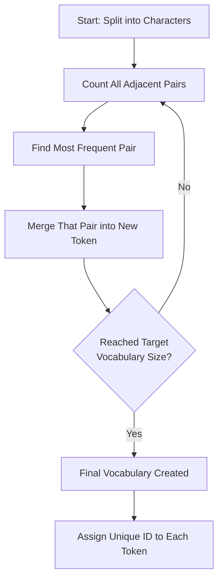
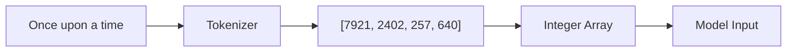
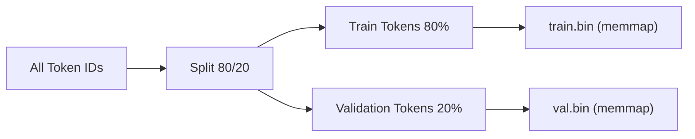

# 🛸 Understanding Language Models (Alien Analogy Explanation)

## 📍 Introduction
Imagine you are an **alien from outer space** who does **not understand any human language**.  
You cannot read or speak English, Hindi, French, anything.  
But you **do** understand **math** and **logical reasoning**.

Now someone gives you a sentence and asks:

> **“Predict the next word.”**

How would you do that if you don’t know the language?

This README explains how that leads to the concept of  
**Large Language Models (LLMs)** and **Small Language Models (SLMs)**.

---

# 1️⃣ Solution 1 — Use the Entire Internet (Inefficient)

You could:

- Collect **all books, blogs, articles, tweets, PDFs** on Earth  
- Search for similar sentences  
- Guess the next word based on raw frequency  

This requires effort roughly like:

x × x × x × … × x    (x = number of words on Earth)

This approach is **computationally explosive** and unrealistic.

---

# 2️⃣ Solution 2 — Build a Model to Predict the Next Word

Instead of memorizing everything, build a **mathematical model** that learns patterns  
and can **predict the next word from context**, even for sentences it has never seen before.

This type of model is called a:

# 🚀 **Large Language Model (LLM)**

---

# 🔧 LLM as a Next-Word Predicting Engine (Diagram)



An LLM takes a sequence of words and outputs the most probable next word.

---

# 🏗️ Why Are They Called “Large”?

Because of the **number of parameters** (learnable weights) they contain.

### 📌 Examples
| Model / Equation | Parameters |
|------------------|------------|
| Linear equation y = mx + c | 2 |
| Quadratic equation y = ax² + bx + c | 3 |
| GPT-3 | 175,000,000,000+ |

Parameters = knobs the model adjusts during training.

---

# 🎯 Is Next-Token Prediction Probabilistic or Deterministic?

It is **probabilistic**.

The model outputs a **probability distribution** over all possible next words.

Example:

| Word | Probability |
|-------|-------------|
| mat | 0.67 |
| dog | 0.12 |
| street | 0.08 |

The word with the **highest probability** is chosen.

---

# 📈 Why Do We Need So Many Parameters?

As researchers scaled model size, they found:

- Accuracy improves  
- Reasoning improves  
- Language understanding gets deeper  

This relationship is shown in the GPT-3 scaling laws.

---

# 📊 GPT-3 Scaling Law Graph (Actual Image)


---

# 🧬 Why Build Bigger and Bigger Models?

Large models show **emergent properties** —  
capabilities that smaller models do *not* have at all.

These include:

- Translation  
- Reasoning  
- Code generation  
- Multi-step logic  
- Summarization  
- Humor understanding  

We don't know the exact threshold at which these abilities appear.

So researchers keep building bigger models to discover new emergent skills.

---

# 📈 Emergent Abilities Graph (Actual Image)


---

# 🧠 What Else Do LLMs Learn?

Even though we **only** ask the model to predict the next word…

It automatically learns:

- Grammar (form)  
- Meaning (semantics)  
- Structure  
- Relationships between concepts  
- World knowledge patterns  

All as a **side effect** of predicting the next token.

---

# 🔍 What If We Don’t Want a Full General Language Model?

Sometimes you only want the model to learn **one domain**, such as:

- Medical texts  
- Legal contracts  
- Semiconductor manufacturing data  
- Finance documents  
- Customer support chat logs  
- Programming code  

A small dataset → fewer patterns → **fewer parameters needed**.

Thus we get:

# 🌱 **Small Language Models (SLMs)**

Focused  
Efficient  
Domain-special  
Cheaper to train  
Ideal for constrained hardware

---
# Building a Small Language Model (SLM) - Complete Guide

## 1. Choosing a Dataset

TinyStories dataset is used as it captures grammar, syntax, and story structure in simple language ideal for small models.



## 2. Data Preprocessing & Tokenization

Tokenization is the process of converting text into numerical tokens that a model can process. It's like creating a dictionary where each entry gets a unique number.

### ❌ Word-based Tokenization

**How it works:** Each unique word becomes one token
- Example: "The cat runs" → `[452, 234, 789]`

**Problems:**
- Huge vocabulary (100,000+ tokens for English)
- Out-of-Vocabulary (OOV) issues - can't handle new/rare words
- Misspelled words cannot be encoded
- Related words treated as completely different: "run", "runs", "running" are 3 separate tokens
- Slow & brittle
- Wastes model capacity learning similar words separately

### ❌ Character-based Tokenization

**How it works:** Each character (letter) becomes one token
- Example: "cat" → `[c, a, t]` → `[3, 1, 20]`

**Problems:**
- Small vocabulary (~26-100 tokens) ✓
- Very long sequences → much slower training
- Model must learn to build words from scratch
- Loses semantic meaning - "c", "a", "t" individually mean nothing
- "understanding" = 13 tokens instead of 1-3

### ✅ Subword Tokenization (BPE - Byte Pair Encoding)

**How it works:** Words are split into meaningful subword units based on frequency

Modern LLMs use BPE because it provides the best balance:

**Advantages:**
- **Solves OOV problem:** Can encode any word by breaking into known pieces
- **Preserves meaning:** Common words stay whole, rare words split meaningfully
- **Efficient vocabulary:** Typically 5,000-50,000 tokens (optimal size)
- **Faster training:** Shorter sequences than character-level
- **Handles misspellings:** Unknown words decompose into recognizable parts
- **Language agnostic:** Works across different languages

**Example of BPE in action:**

```
Common word: "the" → ["the"] (stays whole)
Rare word: "understanding" → ["under", "stand", "ing"]
Misspelled: "runnnning" → ["run", "nn", "ning"]
New word: "unbelievablex" → ["un", "believ", "able", "x"]
```

### How BPE Training Works



**Step-by-step example:**

1. **Initial text:** "low", "lower", "lowest", "flower"
2. **Split to characters:** `['l','o','w'], ['l','o','w','e','r'], ['l','o','w','e','s','t'], ['f','l','o','w','e','r']`
3. **Count pairs:** ('l','o')=4 times, ('o','w')=4 times, ('w','e')=3 times...
4. **Merge most frequent:** ('l','o') → token 'lo'
5. **Repeat:** 'lo' + 'w' → 'low', eventually creating meaningful subwords

**Result:** The model learns that "low", "er", "est", "flow" are meaningful units!

## 3. Text to Token IDs

After tokenizer training:



- Each story becomes a sequence of integer token IDs
- All stories are concatenated into one long token stream
- The model learns to predict the next token ID given previous ones

**Example:**
```
Text: "Once upon a time, there was a little girl."
Tokens: ["Once", "upon", "a", "time", ",", "there", "was", "a", "little", "girl", "."]
Token IDs: [7921, 2402, 257, 640, 11, 612, 373, 257, 1310, 2576, 13]
```

## 4. Train/Validation Split



**Why split?**
- **Training set (80%):** Model learns patterns from this
- **Validation set (20%):** Tests if model generalizes to unseen data
- Prevents overfitting - ensures model truly understands language, not just memorizes

**Binary format (.bin):**
- Stores token IDs as raw integers (numpy arrays)
- Memory-mapped (memmap) for efficient loading
- Faster than loading text files during training
- Typical size: Millions to billions of tokens
